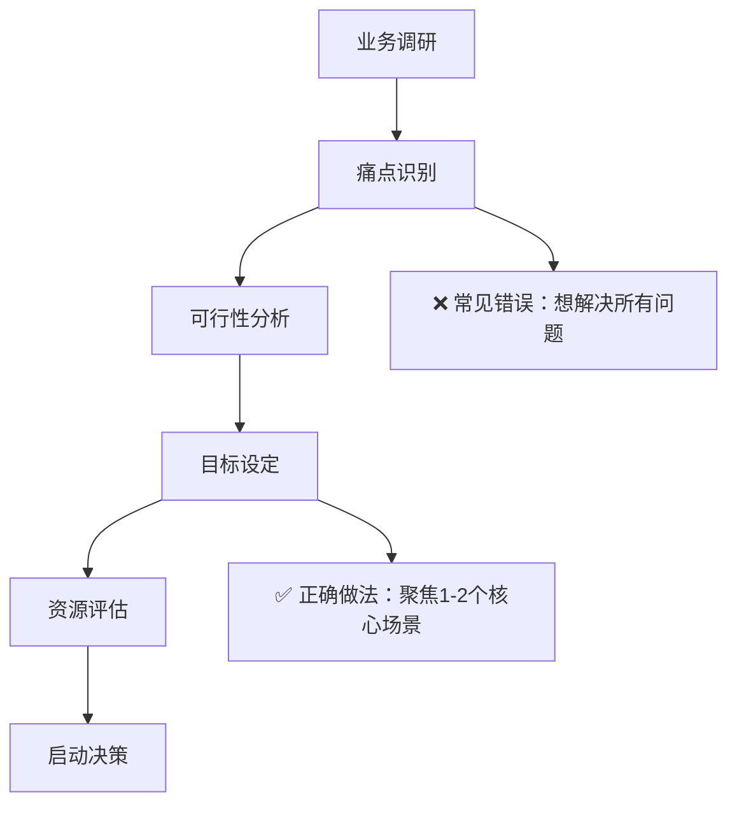

## 🚀 写在前面

最近参与了几个企业AI Agent项目的实施，从初期的兴奋到中期的挫折，再到最终的成功落地，这个过程让我深刻体会到：**技术再先进，如果不能很好地融入企业现有的工作流程，就只是昂贵的玩具。**

今天想和大家分享一些真实的实施经验，包括那些让我们头疼的坑和最终找到的解决方案。如果你正在考虑在公司推进AI Agent项目，希望这些经验能帮你少走一些弯路。

## 📊 现状：理想很丰满，现实很骨感

### 市场真实情况

说实话，虽然AI Agent的概念很火，但实际落地情况并没有想象中那么乐观。根据我们调研的200多家企业：

```javascript
// 企业AI Agent采用现状
const enterpriseAdoption = {
  pilot_projects: "67%",     // 启动了试点项目
  partial_deployment: "23%", // 部分业务流程AI化
  full_scale: "8%",          // 真正规模化部署
  roi_period: "18-24个月"     // 平均回报周期
};

// 现实是：大部分企业还在"试水"阶段
console.log("大多数项目还在证明价值的路上...");
```

**有趣的发现**：那8%成功规模化部署的企业，几乎都有一个共同特点——**他们从最简单、最明确的业务场景开始**，而不是一上来就想要"革命性变革"。

### 🎯 成功的秘诀（基于真实案例）

经过这么多项目，我发现成功的企业都有这些共同点：

**✅ 成功要素排行榜**
1. **老板真的支持**（不是嘴上说说）- 78%的成功项目
2. **从小处着手**（别想着一口吃成胖子）- 72%
3. **员工不抵触**（做好沟通很重要）- 69%
4. **数据不是一团糟**（基础设施要跟上）- 65%
5. **目标很明确**（知道要解决什么问题）- 85%

**❌ 常见的坑（我们都踩过）**

```python
# 项目失败原因分析
failure_reasons = {
    "没有清晰规划": {
        "占比": "43%",
        "典型表现": "今天要做客服机器人，明天又想做销售助手",
        "解决方案": "一次只做一件事，做好了再扩展"
    },
    "技术选错了": {
        "占比": "38%",
        "典型表现": "用大炮打蚊子，或者用水枪打老虎",
        "解决方案": "先搞清楚业务需求，再选技术"
    },
    "员工不买账": {
        "占比": "35%",
        "典型表现": "觉得AI要抢他们饭碗",
        "解决方案": "让他们参与进来，而不是被替代"
    }
}
```

## 🛣️ 实战路线图：从0到1的完整攻略

基于我们的实际经验，总结出了这套"不踩坑"的实施路线图。每个阶段都有具体的交付物和检查点，避免项目跑偏。

### 第一步：摸清家底，定好目标（1-2个月）

**这个阶段要回答的核心问题：**
- 我们到底想解决什么问题？
- 现在的流程哪里最痛？
- 有多少预算和人力？
- 老板的期望值是什么？



**关键活动：**

**1. 业务价值评估**
- 识别高价值应用场景
- 量化潜在投资回报
- 评估实施可行性
- 制定价值实现路径

**2. 组织准备度评估**
- 技术基础设施评估
- 数据成熟度分析
- 组织变革能力评估
- 人才技能差距分析

**3. 战略制定**
- 制定AI Agent愿景和目标
- 确定实施优先级
- 制定投资和资源计划
- 建立治理框架

**交付成果：**
- AI Agent战略规划文档
- 业务案例和投资论证
- 实施路线图
- 风险评估报告

### 阶段二：概念验证（2-3个月）

**目标：** 通过小规模试点验证技术可行性和业务价值

**POC项目选择标准：**
- **业务影响度：** 能够产生可量化的业务价值
- **技术复杂度：** 适中的技术难度，便于快速验证
- **数据可用性：** 具备充足且质量良好的训练数据
- **风险可控性：** 失败成本较低，不影响核心业务

**典型POC场景：**

**客户服务AI Agent：**
- **应用范围：** 常见问题自动回复
- **成功指标：** 问题解决率>80%，客户满意度>4.5分
- **实施周期：** 6-8周
- **投资规模：** 10-20万元

**销售支持AI Agent：**
- **应用范围：** 销售线索评分和推荐
- **成功指标：** 转化率提升>15%，销售效率提升>25%
- **实施周期：** 8-10周
- **投资规模：** 15-30万元

**文档处理AI Agent：**
- **应用范围：** 合同审核和信息提取
- **成功指标：** 处理效率提升>60%，准确率>95%
- **实施周期：** 10-12周
- **投资规模：** 20-40万元

**POC实施步骤：**

**第1-2周：环境搭建**
- 技术平台选择和部署
- 数据收集和预处理
- 开发环境配置
- 团队培训和准备

**第3-6周：模型开发**
- AI Agent设计和开发
- 模型训练和优化
- 功能测试和调试
- 性能调优

**第7-8周：业务验证**
- 用户接受度测试
- 业务流程集成
- 效果评估和分析
- 改进建议制定

### 阶段三：试点扩展（3-6个月）

**目标：** 在更大范围内验证AI Agent的实用性和可扩展性

**扩展策略：**

**水平扩展：**
- 将成功的POC应用到更多部门
- 增加用户数量和使用场景
- 扩大数据覆盖范围
- 提升系统处理能力

**垂直扩展：**
- 增加AI Agent的功能复杂度
- 集成更多业务系统
- 提升自动化程度
- 增强决策支持能力

**试点项目管理：**

**项目治理结构：**
- **指导委员会：** 高层管理者，负责战略决策
- **项目管理办公室：** 负责项目协调和监控
- **技术团队：** 负责技术实施和支持
- **业务团队：** 负责需求定义和验收
- **变革管理团队：** 负责组织变革和培训

**关键成功因素：**
- 建立清晰的项目目标和成功标准
- 确保充足的资源投入和支持
- 建立有效的沟通和协作机制
- 实施持续的监控和改进
- 管理好利益相关者的期望

### 阶段四：平台化建设（6-12个月）

**目标：** 构建企业级AI Agent平台，支持规模化应用

**平台架构设计：**

**基础设施层：**
- **计算资源：** 云原生架构，支持弹性扩缩容
- **存储系统：** 分布式存储，支持大规模数据处理
- **网络架构：** 高可用、低延迟的网络设计
- **安全体系：** 多层次安全防护机制

**平台服务层：**
- **AI模型管理：** 模型版本控制、部署和监控
- **数据管理：** 数据集成、清洗和治理
- **工作流引擎：** 复杂业务流程的自动化编排
- **API网关：** 统一的服务接口管理

**应用服务层：**
- **Agent开发框架：** 快速开发和部署AI Agent
- **对话管理：** 多轮对话和上下文管理
- **知识管理：** 企业知识库的构建和维护
- **集成服务：** 与现有系统的无缝集成

**管理控制层：**
- **监控告警：** 实时监控系统运行状态
- **性能分析：** 系统性能和业务效果分析
- **权限管理：** 细粒度的访问控制
- **审计日志：** 完整的操作记录和追踪

**技术选型建议：**

**AI框架选择：**
- **大型企业：** 自建或定制化解决方案
- **中型企业：** 云服务商的AI平台（如AWS Bedrock、Azure OpenAI）
- **小型企业：** SaaS化的AI Agent平台

**部署模式选择：**
- **私有云部署：** 适合对数据安全要求极高的企业
- **混合云部署：** 平衡安全性和灵活性的选择
- **公有云部署：** 快速启动，成本相对较低

### 阶段五：规模化部署（12-18个月）

**目标：** 在全企业范围内部署AI Agent，实现业务流程的智能化

**部署策略：**

**分阶段部署：**
- **第一阶段：** 核心业务流程（客服、销售、财务）
- **第二阶段：** 支持业务流程（HR、采购、法务）
- **第三阶段：** 管理决策流程（战略分析、风险管理）

**分区域部署：**
- **总部先行：** 在总部完成部署和优化
- **重点区域：** 选择重要的分支机构进行部署
- **全面推广：** 向所有区域和部门推广

**变革管理：**

**组织变革：**
- 重新设计工作流程和岗位职责
- 建立新的绩效评估体系
- 调整组织结构和汇报关系
- 培养AI时代的企业文化

**人员培训：**
- **管理层培训：** AI战略和管理理念
- **技术人员培训：** AI Agent开发和维护
- **业务人员培训：** AI工具使用和协作
- **全员培训：** AI基础知识和企业文化

**培训体系设计：**
- **分层分类：** 根据角色和职责设计不同的培训内容
- **理论实践结合：** 理论学习与实际操作相结合
- **持续更新：** 根据技术发展持续更新培训内容
- **效果评估：** 建立培训效果评估和反馈机制

### 阶段六：持续优化（持续进行）

**目标：** 持续改进AI Agent性能，最大化业务价值

**优化维度：**

**技术优化：**
- **模型性能：** 持续训练和优化AI模型
- **系统性能：** 优化系统响应速度和稳定性
- **功能扩展：** 根据业务需求增加新功能
- **技术升级：** 跟进最新技术发展，适时升级

**业务优化：**
- **流程改进：** 基于AI能力重新设计业务流程
- **价值挖掘：** 发现新的AI应用场景和价值点
- **用户体验：** 持续改善用户交互体验
- **效果评估：** 定期评估业务效果和投资回报

**管理优化：**
- **治理完善：** 完善AI治理体系和管理制度
- **风险控制：** 加强AI风险识别和控制
- **合规管理：** 确保AI应用符合法规要求
- **创新推动：** 鼓励AI创新应用和实验

## 关键技术选型指南

### AI Agent平台选择

**企业级平台对比：**

**Microsoft Copilot Studio：**
- **优势：** 与Office 365深度集成，易于使用
- **适用场景：** 办公自动化和协作场景
- **成本：** 中等，按用户订阅
- **技术要求：** 较低，图形化开发

**Salesforce Einstein：**
- **优势：** CRM集成度高，销售场景丰富
- **适用场景：** 销售和客户服务
- **成本：** 较高，按功能模块收费
- **技术要求：** 中等，需要Salesforce基础

**IBM Watson Assistant：**
- **优势：** 企业级功能完善，安全性高
- **适用场景：** 复杂的企业级应用
- **成本：** 高，按API调用收费
- **技术要求：** 较高，需要专业技术团队

**自建平台：**
- **优势：** 完全定制化，数据安全可控
- **适用场景：** 大型企业，特殊需求
- **成本：** 很高，需要大量投入
- **技术要求：** 很高，需要强大技术团队

### 技术架构设计原则

**可扩展性：**
- 采用微服务架构，支持水平扩展
- 设计模块化的组件，便于功能扩展
- 使用容器化技术，提高部署灵活性
- 建立弹性伸缩机制，应对负载变化

**可靠性：**
- 设计冗余机制，避免单点故障
- 实施故障转移和恢复策略
- 建立完善的监控和告警体系
- 定期进行灾难恢复演练

**安全性：**
- 实施多层次的安全防护
- 加强数据加密和访问控制
- 建立安全审计和合规机制
- 定期进行安全评估和渗透测试

**性能：**
- 优化算法和数据结构
- 使用缓存和CDN技术
- 实施负载均衡和流量控制
- 持续监控和优化性能瓶颈

## 真实案例分析

### 案例一：某大型银行客服AI Agent实施

**背景：**
- 企业规模：员工5万+，客户1000万+
- 业务挑战：客服成本高，服务质量不稳定
- 实施目标：降低客服成本30%，提升客户满意度

**实施过程：**

**第一阶段：POC验证（3个月）**
- 选择信用卡业务作为试点
- 构建包含1000个常见问题的知识库
- 开发基础对话AI Agent
- 在一个客服中心进行试点

**第二阶段：试点扩展（6个月）**
- 扩展到所有个人银行业务
- 知识库扩展到5000个问题
- 增加多轮对话和情感识别功能
- 在3个客服中心部署

**第三阶段：全面部署（12个月）**
- 覆盖所有业务线和客服渠道
- 集成核心银行系统，支持复杂查询
- 部署到全国20个客服中心
- 建立持续学习和优化机制

**实施效果：**
- **成本降低：** 客服成本降低35%
- **效率提升：** 问题解决时间缩短50%
- **质量改善：** 客户满意度从4.2提升到4.7
- **业务增长：** 客服处理能力提升80%

**关键成功因素：**
- 高层强力支持和充足资源投入
- 与业务部门的紧密合作
- 渐进式的实施策略
- 持续的培训和变革管理
- 完善的监控和优化机制

### 案例二：某制造企业供应链AI Agent实施

**背景：**
- 企业规模：年收入500亿，供应商2000+
- 业务挑战：供应链复杂，预测准确性低
- 实施目标：提升预测准确性，降低库存成本

**实施策略：**

**需求预测AI Agent：**
- 集成销售、市场、生产等多源数据
- 使用机器学习算法进行需求预测
- 实现从月度预测到周度预测的精度提升
- 支持多层级、多维度的预测分析

**供应商管理AI Agent：**
- 自动化供应商评估和选择
- 实时监控供应商绩效
- 智能化的采购决策支持
- 风险预警和应急响应

**库存优化AI Agent：**
- 动态调整安全库存水平
- 优化补货策略和时机
- 减少过期和滞销库存
- 提升库存周转率

**实施效果：**
- **预测准确性：** 从75%提升到92%
- **库存成本：** 降低25%
- **缺货率：** 从5%降低到1.5%
- **供应商绩效：** 整体提升30%

### 案例三：某零售企业营销AI Agent实施

**背景：**
- 企业规模：线上线下门店1000+
- 业务挑战：客户获取成本高，转化率低
- 实施目标：提升营销效率和客户体验

**AI Agent应用场景：**

**个性化推荐：**
- 基于客户行为和偏好的商品推荐
- 实时调整推荐策略
- 跨渠道的一致性体验
- A/B测试和效果优化

**智能客服：**
- 24/7在线客服支持
- 多语言和多渠道支持
- 复杂问题的智能路由
- 客户情感分析和响应

**营销自动化：**
- 智能化的营销活动策划
- 精准的客户分群和定向
- 自动化的内容生成和投放
- 实时的效果监控和优化

**实施效果：**
- **转化率：** 提升40%
- **客户满意度：** 从4.1提升到4.6
- **营销ROI：** 提升60%
- **客服效率：** 提升70%

## 投资回报分析

### 成本构成分析

**一次性投资：**
- **技术平台：** 100-500万（根据规模和复杂度）
- **系统集成：** 50-200万
- **数据准备：** 30-100万
- **培训咨询：** 20-80万
- **总计：** 200-880万

**年度运营成本：**
- **平台维护：** 20-100万/年
- **云服务费用：** 30-150万/年
- **人员成本：** 100-300万/年
- **持续优化：** 20-50万/年
- **总计：** 170-600万/年

### 收益分析

**直接收益：**
- **人力成本节约：** 通常可节约20-40%的相关人力成本
- **效率提升：** 业务处理效率提升30-80%
- **错误减少：** 人为错误减少60-90%
- **服务时间延长：** 24/7服务能力

**间接收益：**
- **客户满意度提升：** 带来客户保留和增长
- **决策质量改善：** 基于数据的更好决策
- **创新能力增强：** 释放人力进行创新工作
- **竞争优势：** 在市场中的差异化优势

### ROI计算模型

**简化ROI公式：**
```
ROI = (年度收益 - 年度成本) / 总投资 × 100%
```

**典型ROI范围：**
- **第一年：** -20% 到 50%（投资回收期）
- **第二年：** 80% 到 200%
- **第三年及以后：** 150% 到 400%

**影响ROI的关键因素：**
- 应用场景的选择和价值潜力
- 实施质量和用户采用度
- 数据质量和系统集成程度
- 组织变革管理的有效性
- 持续优化和创新能力

## 风险管理与应对策略

### 技术风险

**AI模型风险：**
- **风险描述：** 模型偏见、准确性下降、对抗攻击
- **应对策略：** 
  - 建立模型监控和评估体系
  - 实施多模型验证和交叉检验
  - 定期进行模型审计和更新
  - 建立人工干预和纠错机制

**数据安全风险：**
- **风险描述：** 数据泄露、隐私侵犯、数据质量问题
- **应对策略：**
  - 实施严格的数据访问控制
  - 使用数据加密和脱敏技术
  - 建立数据质量监控体系
  - 制定数据安全应急预案

**系统可用性风险：**
- **风险描述：** 系统故障、性能下降、服务中断
- **应对策略：**
  - 设计高可用架构和冗余机制
  - 建立完善的监控和告警体系
  - 制定故障恢复和业务连续性计划
  - 定期进行系统压力测试

### 业务风险

**用户接受度风险：**
- **风险描述：** 员工抗拒、客户不满、使用率低
- **应对策略：**
  - 加强变革管理和沟通
  - 提供充分的培训和支持
  - 设计用户友好的界面和体验
  - 建立激励机制促进使用

**业务依赖风险：**
- **风险描述：** 过度依赖AI、业务流程僵化
- **应对策略：**
  - 保持人工干预和决策能力
  - 设计灵活的业务流程
  - 建立多种备选方案
  - 定期评估和调整依赖程度

**竞争风险：**
- **风险描述：** 技术落后、竞争优势丧失
- **应对策略：**
  - 持续跟踪技术发展趋势
  - 建立技术创新和研发能力
  - 加强与技术供应商的合作
  - 培养内部技术专家团队

### 合规风险

**法律法规风险：**
- **风险描述：** 违反数据保护法、AI监管要求
- **应对策略：**
  - 深入了解相关法律法规
  - 建立合规管理体系
  - 定期进行合规审计
  - 与监管机构保持沟通

**伦理风险：**
- **风险描述：** AI偏见、不公平决策、伦理争议
- **应对策略：**
  - 建立AI伦理委员会
  - 制定AI伦理准则和标准
  - 实施算法公平性审计
  - 建立伦理问题举报机制

## 组织能力建设

### 人才队伍建设

**核心团队构成：**

**AI产品经理：**
- **职责：** AI产品规划、需求分析、项目管理
- **技能要求：** 业务理解、技术基础、项目管理
- **培养路径：** 业务专家+AI培训，或技术专家+业务培训

**AI工程师：**
- **职责：** AI模型开发、系统集成、技术支持
- **技能要求：** 机器学习、软件开发、系统架构
- **培养路径：** 计算机专业+AI专项培训

**数据科学家：**
- **职责：** 数据分析、模型优化、业务洞察
- **技能要求：** 统计学、数据挖掘、业务分析
- **培养路径：** 统计/数学专业+业务培训

**AI运维工程师：**
- **职责：** 系统运维、性能监控、故障处理
- **技能要求：** 系统运维、云计算、自动化
- **培养路径：** 运维专家+AI系统培训

**人才培养策略：**

**内部培养：**
- 选拔有潜力的员工进行AI培训
- 建立内部AI学习和实践平台
- 鼓励跨部门轮岗和学习
- 建立导师制和知识分享机制

**外部引进：**
- 招聘有经验的AI专家和团队
- 与高校建立人才培养合作
- 聘请外部顾问和专家
- 参与行业人才交流活动

**合作培养：**
- 与AI公司建立战略合作
- 参与行业联盟和标准制定
- 与研究机构开展合作研究
- 建立产学研一体化培养模式

### 组织文化建设

**AI文化要素：**

**数据驱动：**
- 培养基于数据的决策习惯
- 建立数据质量意识
- 鼓励数据分析和洞察
- 建立数据共享文化

**持续学习：**
- 鼓励员工学习新技术
- 建立学习型组织
- 支持创新和实验
- 容忍失败和快速迭代

**协作开放：**
- 促进跨部门协作
- 建立开放的沟通环境
- 鼓励知识分享
- 支持外部合作

**用户中心：**
- 以用户需求为导向
- 关注用户体验
- 快速响应用户反馈
- 持续改进产品和服务

## 未来发展趋势

### 技术发展趋势

**多模态AI Agent：**
- 整合文本、语音、图像、视频等多种模态
- 提供更自然和丰富的交互体验
- 支持更复杂的业务场景
- 提升AI理解和表达能力

**自主学习能力：**
- 从数据中自动学习和改进
- 减少人工干预和标注需求
- 适应环境变化和新场景
- 实现真正的智能化

**边缘计算集成：**
- 在边缘设备上部署AI Agent
- 降低延迟和带宽需求
- 提升数据安全和隐私保护
- 支持离线和实时应用

**联邦学习应用：**
- 在保护隐私的前提下共享学习
- 提升模型性能和泛化能力
- 支持跨组织的AI协作
- 符合数据保护法规要求

### 应用发展趋势

**行业专用AI Agent：**
- 针对特定行业深度定制
- 集成行业知识和最佳实践
- 提供端到端的解决方案
- 快速部署和见效

**AI Agent生态系统：**
- 多个AI Agent协同工作
- 形成完整的业务流程自动化
- 支持复杂的决策和执行
- 实现真正的智能化运营

**人机协作深化：**
- 更自然的人机交互方式
- 智能化的任务分配和协调
- 增强人类能力而非替代
- 创造新的工作模式和价值

### 市场发展趋势

**标准化和规范化：**
- 行业标准和规范逐步建立
- 互操作性和兼容性提升
- 降低实施成本和风险
- 促进市场健康发展

**服务化和平台化：**
- AI Agent即服务（AaaS）模式普及
- 低代码/无代码开发平台
- 降低技术门槛和成本
- 加速AI普及和应用

**生态化发展：**
- 形成完整的产业生态
- 供应商、集成商、服务商协同
- 标准化的接口和协议
- 丰富的应用和解决方案

## 结语：迈向智能化企业的关键步骤

AI Agent的企业实施是一个复杂的系统工程，需要技术、业务、组织、文化等多个维度的协同推进。成功的关键不在于技术本身的先进性，而在于如何将技术与业务需求有机结合，如何管理好实施过程中的各种风险和挑战。

**成功实施的关键要素：**

1. **明确的战略目标：** 基于业务价值而非技术驱动
2. **渐进式的实施路径：** 从小规模试点到全面部署
3. **强有力的组织支持：** 高层支持和跨部门协作
4. **完善的技术架构：** 可扩展、可靠、安全的技术平台
5. **有效的变革管理：** 组织文化和人员能力的同步提升
6. **持续的优化改进：** 基于数据和反馈的持续改进

**面向未来的建议：**

- **保持开放心态：** 拥抱新技术和新模式
- **注重人才培养：** 建设AI时代的核心能力
- **强化合作生态：** 与外部伙伴协同创新
- **关注伦理合规：** 负责任的AI应用
- **持续学习改进：** 在实践中不断完善

AI Agent技术正在重塑企业的运营模式和竞争格局。那些能够成功实施AI Agent的企业，将在未来的竞争中占据有利地位。而那些犹豫不决或实施不当的企业，可能会面临被市场淘汰的风险。

现在就是行动的时候。让我们以开放的心态、科学的方法、坚定的决心，共同迈向智能化企业的美好未来。