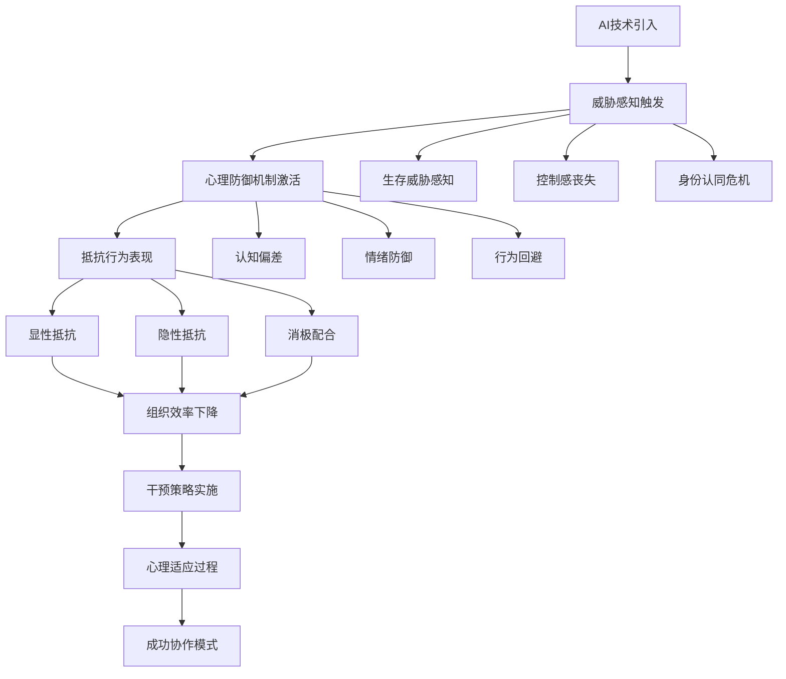
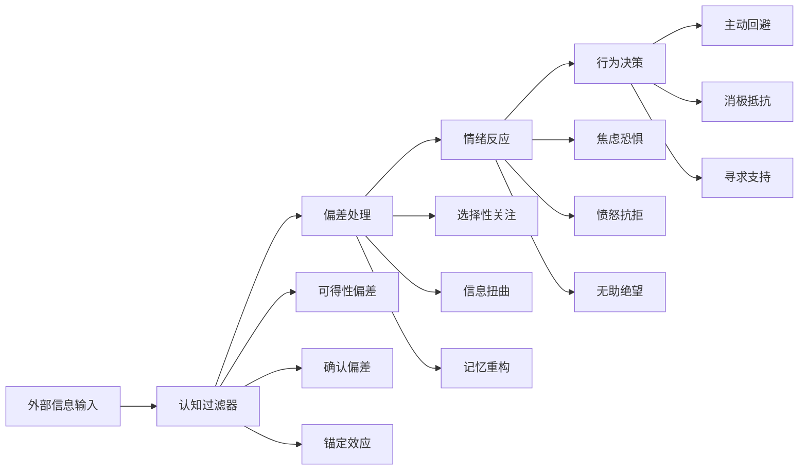

## 🧠 AI Agent抵抗心理学深度解析

### 📊 AI恐惧现象数据概览

在AI Agent快速普及的今天，一个令人困惑的现象正在企业中蔓延：尽管AI技术承诺提升效率和减轻工作负担，但许多员工却表现出强烈的抵触情绪。这种"AI恐惧症"不仅影响技术采用效果，更可能成为企业数字化转型的最大障碍。

#### AI抵抗情绪统计分析

```javascript
// 2025年企业AI采用阻力调研数据
const aiResistanceData = {
    "员工态度分布": {
        "强烈抵抗": { "比例": "23%", "主要原因": "担心失业", "影响程度": "严重" },
        "消极配合": { "比例": "34%", "主要原因": "技能焦虑", "影响程度": "中等" },
        "中性观望": { "比例": "28%", "主要原因": "不确定性", "影响程度": "轻微" },
        "积极拥抱": { "比例": "15%", "主要原因": "效率提升", "影响程度": "正面" }
    },
    "行业差异": {
        "金融服务": "抵抗率42%",
        "制造业": "抵抗率38%",
        "科技行业": "抵抗率18%",
        "教育行业": "抵抗率45%",
        "医疗健康": "抵抗率52%"
    },
    "影响因素权重": [
        "工作安全感: 35%",
        "技能适应性: 28%",
        "组织文化: 22%",
        "管理层态度: 15%"
    ]
};

console.log("AI抵抗心理分析:", aiResistanceData);
```

### 🎯 心理抵抗机制流程图



## 🔍 AI抵抗的心理根源深度分析

### 🧬 生存威胁感知

**进化心理学视角：** 人类大脑的威胁检测系统在面对AI Agent时会产生原始的生存恐惧。这种恐惧源于对"被替代"的深层担忧，触发了与失去食物来源相似的生存焦虑。

**数据支撑：** Pew Research的研究显示，虽然67%的美国人认为AI将对劳动力产生重大影响，但只有13%的人相信AI会对他们个人有帮助。这种认知差异反映了一种心理防御机制——"这会影响别人，但不会影响我"。

```python
# 威胁感知评估模型
class ThreatPerceptionModel:
    def __init__(self):
        self.threat_factors = {
            "job_security": 0.35,
            "skill_relevance": 0.28,
            "career_growth": 0.22,
            "social_status": 0.15
        }
    
    def calculate_threat_level(self, employee_profile):
        threat_score = 0
        for factor, weight in self.threat_factors.items():
            threat_score += employee_profile[factor] * weight
        
        return {
            "threat_level": threat_score,
            "risk_category": self.categorize_risk(threat_score),
            "intervention_priority": self.get_priority(threat_score)
        }
    
    def categorize_risk(self, score):
        if score >= 0.7: return "高风险"
        elif score >= 0.4: return "中风险"
        else: return "低风险"

# 使用示例
model = ThreatPerceptionModel()
employee = {
    "job_security": 0.8,
    "skill_relevance": 0.6,
    "career_growth": 0.7,
    "social_status": 0.5
}

result = model.calculate_threat_level(employee)
print(f"威胁感知评估: {result}")
```

### ⚖️ 控制感丧失

**心理控制理论：** 人类有强烈的控制环境的需求。当AI Agent开始"自主"执行任务时，员工会感到失去对工作流程的控制，这种失控感会引发焦虑和抵抗。

**案例分析：** 一家保险公司引入AI客服后，人工客服代表报告称感到"被边缘化"。他们担心AI处理客户问题的方式不够人性化，但又无法干预AI的决策过程。

### 🎭 身份认同危机

**职业身份理论：** 工作不仅是谋生手段，更是个人身份的重要组成部分。当AI Agent能够执行员工的核心工作时，会触发深层的身份认同危机。

**心理机制分析：**
- **技能贬值恐惧：** 担心多年积累的专业技能变得无用
- **价值感缺失：** 怀疑自己在组织中的价值和地位
- **未来不确定性：** 对职业发展前景感到迷茫
- **社会认同焦虑：** 担心失去专业群体的归属感

## 🎭 AI恐惧的表现形式分析

### 🚫 显性抵抗行为

**主动回避策略：**
- 🔒 拒绝使用AI工具或系统
- 📚 寻找借口避免参与AI相关培训
- ❓ 公开质疑AI技术的可靠性和必要性
- 🗣️ 在会议中提出技术风险和伦理问题

**消极对抗模式：**
- ⏱️ 故意降低AI工具的使用效率
- 📰 传播关于AI失败案例的负面信息
- 👥 在团队中营造反AI情绪
- 📊 选择性报告AI应用的负面结果

### 🎪 隐性抵抗行为

**表面配合，内心抗拒：**
- 🎯 形式上使用AI工具，但不充分发挥其功能
- 🔍 对AI输出结果过度质疑和检查
- 💾 保持传统工作方式作为"备份"
- ⚡ 在关键时刻"技术故障"回归人工操作

**心理防御机制矩阵：**

```javascript
// 心理防御机制分类系统
const defensemechanisms = {
    "否认型防御": {
        "表现": "认为AI技术不会真正影响自己的工作",
        "内在逻辑": "我的工作太复杂，AI无法胜任",
        "风险等级": "中等",
        "干预策略": "提供具体成功案例和渐进式体验"
    },
    "合理化防御": {
        "表现": "找各种理由证明人工方式更优",
        "内在逻辑": "人工操作更可靠、更有温度",
        "风险等级": "高",
        "干预策略": "数据对比和客观评估"
    },
    "投射型防御": {
        "表现": "将对AI的恐惧转化为对管理层决策的不满",
        "内在逻辑": "问题不在我，而在决策者",
        "风险等级": "严重",
        "干预策略": "增强参与感和决策透明度"
    },
    "回避型防御": {
        "表现": "通过各种方式避免接触AI技术",
        "内在逻辑": "眼不见心不烦",
        "风险等级": "中等",
        "干预策略": "创造安全的学习环境"
    }
};

console.log("心理防御机制分析:", defensemechanisms);
```

## 🧠 恐惧的深层心理机制解析

### 🔄 认知偏差的作用机制

#### 核心认知偏差类型

- **🎯 可得性偏差：** 媒体对AI威胁的报道使员工更容易回忆起AI的负面影响，而忽视其积极作用
- **✅ 确认偏差：** 员工倾向于寻找和关注支持其AI恐惧的信息，而忽视相反的证据
- **📉 损失厌恶：** 相比于AI可能带来的收益，员工更关注可能失去的东西（工作、地位、技能价值）
- **⚖️ 锚定效应：** 首次接触AI的负面体验会成为后续判断的"锚点"
- **🔮 预测偏差：** 高估AI发展速度和影响范围，低估自身适应能力

#### 认知偏差影响模型



### 👥 社会心理因素分析

**群体动力学效应：**
- **🌊 群体思维：** 当团队中出现反AI情绪时，个体容易受到群体压力影响，即使内心不完全认同也会表现出抵抗行为
- **🏆 社会认同：** 员工可能将抵抗AI视为维护"人类尊严"或"专业价值"的表现，从而获得道德优越感
- **👑 权威依赖：** 如果管理层对AI的态度模糊或消极，员工更容易产生抵抗情绪
- **📢 信息传播：** 负面信息在组织内部传播速度更快，影响范围更广

**社会影响力评估：**

```python
# 社会心理影响因子计算
class SocialInfluenceCalculator:
    def __init__(self):
        self.influence_factors = {
            "peer_pressure": 0.30,
            "leadership_attitude": 0.25,
            "organizational_culture": 0.20,
            "external_media": 0.15,
            "industry_trends": 0.10
        }
    
    def calculate_social_influence(self, environment_data):
        total_influence = 0
        factor_impacts = {}
        
        for factor, weight in self.influence_factors.items():
            impact = environment_data[factor] * weight
            factor_impacts[factor] = impact
            total_influence += impact
        
        return {
            "total_influence_score": total_influence,
            "dominant_factors": sorted(factor_impacts.items(), 
                                     key=lambda x: x[1], reverse=True),
            "intervention_priority": self.get_intervention_priority(factor_impacts)
        }
    
    def get_intervention_priority(self, impacts):
        priorities = []
        for factor, impact in impacts.items():
            if impact > 0.15:
                priorities.append(f"高优先级: {factor}")
            elif impact > 0.08:
                priorities.append(f"中优先级: {factor}")
            else:
                priorities.append(f"低优先级: {factor}")
        return priorities

# 使用示例
calculator = SocialInfluenceCalculator()
environment = {
    "peer_pressure": 0.7,
    "leadership_attitude": 0.4,
    "organizational_culture": 0.6,
    "external_media": 0.8,
    "industry_trends": 0.3
}

result = calculator.calculate_social_influence(environment)
print(f"社会心理影响分析: {result}")
```

## 化解AI恐惧的策略框架

### 认知重构策略

**重新框定AI角色：**
- 将AI Agent定位为"智能助手"而非"替代者"
- 强调AI在处理繁琐任务方面的优势，释放人类进行更有价值工作的时间
- 用"增强"而非"替代"的语言描述AI的作用

**提供成功案例：**
- 分享同行业AI成功应用的案例
- 展示AI如何帮助员工提升工作质量和效率
- 邀请AI应用成功的员工分享经验

### 参与式实施策略

**共同设计原则：**
- 让员工参与AI工具的选择和配置过程
- 收集员工对AI功能需求的意见和建议
- 建立AI应用效果的反馈机制

**渐进式导入：**
- 从低风险、高价值的应用场景开始
- 给员工充分的适应时间和学习机会
- 建立"AI使用选择权"，避免强制推行

### 能力建设策略

**AI素养培训：**
- 帮助员工理解AI的工作原理和局限性
- 培养与AI协作的技能和方法
- 提供持续的技术支持和指导

**职业发展规划：**
- 明确AI时代的职业发展路径
- 提供新技能学习的机会和资源
- 建立基于AI协作能力的晋升标准

### 心理支持策略

**情感关怀：**
- 承认员工对AI的担忧是合理的
- 提供心理咨询和情感支持服务
- 建立开放的沟通渠道，鼓励员工表达担忧

**安全感建设：**
- 明确AI导入不会导致大规模裁员
- 提供职业转型的支持和保障
- 建立基于AI协作的新绩效评估体系

## 成功案例分析

### 案例一：制造业的AI协作转型

**背景：** 某汽车制造企业引入AI质检系统，初期遭到质检员强烈抵制。

**问题：** 质检员担心AI系统会取代他们的工作，影响收入和地位。

**解决方案：**
- **重新定义角色：** 将质检员定位为"质量管理专家"，负责AI系统的监督和优化
- **技能升级：** 提供数据分析和AI系统管理培训
- **激励机制：** 建立基于AI协作效果的奖励制度

**结果：** 6个月后，质检效率提升300%，员工满意度从2.1分提升到4.3分（5分制）。

### 案例二：金融服务的AI客服整合

**背景：** 某银行引入AI客服系统，人工客服代表表现出强烈的职业焦虑。

**问题：** 客服代表担心AI会处理所有客户咨询，导致他们失业。

**解决方案：**
- **分层服务模式：** AI处理标准咨询，人工处理复杂问题和VIP客户
- **专业化发展：** 培养客服代表成为特定领域的专家顾问
- **协作机制：** 建立AI-人工无缝转接的服务流程

**结果：** 客户满意度提升40%，员工转岗率降低60%，人工客服的平均薪资提升25%。

## 组织层面的系统性应对

### 领导力的关键作用

**高层承诺：**
- CEO和高管需要明确表达对AI技术的支持态度
- 展示AI如何支持组织战略目标的实现
- 承诺在AI转型过程中保护员工利益

**中层管理：**
- 培训中层管理者成为AI变革的推动者
- 提供管理AI-人类混合团队的技能培训
- 建立支持AI应用的管理制度和流程

### 文化建设

**学习型组织：**
- 鼓励实验和创新，容忍AI应用中的失误
- 建立知识分享和最佳实践传播机制
- 奖励主动学习和适应AI技术的员工

**开放沟通：**
- 建立定期的AI应用反馈会议
- 创建员工可以自由表达AI相关担忧的平台
- 透明地分享AI应用的进展和挑战

## 未来展望：从抵抗到拥抱

### 心理适应的阶段性特征

**第一阶段：否认和抵抗（0-6个月）**
- 员工拒绝承认AI的价值和必要性
- 表现出各种形式的抵抗行为
- 需要大量的沟通和说服工作

**第二阶段：探索和试验（6-18个月）**
- 开始尝试使用AI工具
- 在安全环境中探索AI的功能
- 逐渐发现AI的实际价值

**第三阶段：接受和整合（18-36个月）**
- 将AI工具整合到日常工作流程中
- 开始依赖AI提升工作效率
- 形成新的工作习惯和模式

**第四阶段：精通和创新（36个月以上）**
- 熟练掌握AI协作技巧
- 主动寻找AI应用的新场景
- 成为AI应用的推广者和创新者

### 建立AI友好的组织文化

**核心价值观：**
- 将AI视为增强人类能力的工具
- 强调持续学习和适应的重要性
- 重视人机协作的创新价值

**制度保障：**
- 建立保护员工在AI转型中权益的政策
- 提供充分的培训和发展机会
- 创建公平的AI时代绩效评估体系

## 实施建议

### 个人层面

- **培养协作意识：** 将AI Agent视为认知伙伴而非工具
- **发展元认知能力：** 了解自己和AI的认知优势与局限
- **保持学习心态：** 持续适应新的协作模式和技术发展
- **维护核心能力：** 在AI协作中保持和发展人类独有的认知能力

### 组织层面

- **设计协作流程：** 建立标准化的人机协作工作流程
- **投资培训体系：** 为员工提供AI协作技能培训
- **建立评估机制：** 开发衡量协作效果的指标体系
- **营造协作文化：** 鼓励实验和学习，容忍协作中的失误

## 结语：恐惧是改变的开始

AI Agent抵抗心理学告诉我们，员工对AI的恐惧并非不合理的偏见，而是面对重大变革时的正常心理反应。理解这种恐惧的根源和机制，是化解抵抗、推动成功转型的关键。

真正的挑战不在于技术本身，而在于如何帮助人们重新定义自己与智能技术的关系。当我们能够将AI Agent从"威胁"转化为"伙伴"，从"替代者"转化为"增强器"时，恐惧就会转化为期待，抵抗就会转化为拥抱。

在这个过程中，组织需要的不仅是技术实施能力，更需要心理洞察力和人文关怀。只有真正理解和关注员工的内心世界，才能在AI时代建立真正可持续的竞争优势。